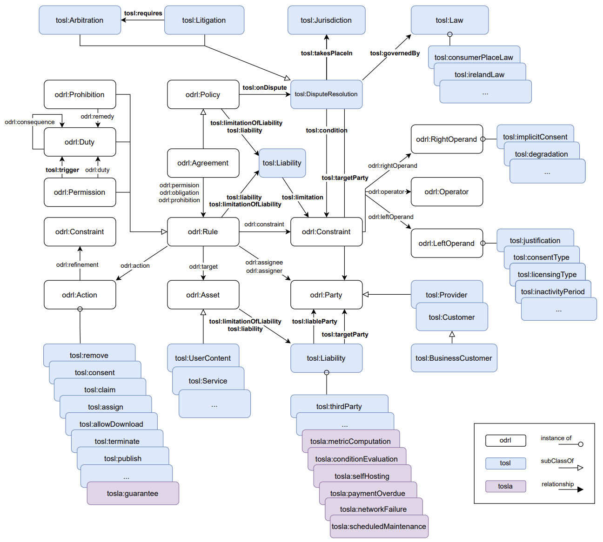

# tosla

Terms of Service Level Agreement (TOSLA) ODRL Profile is a vocabulary designed to incorporate the terminology necessary to semantically represent the terms defined in Service Level Agreements. It extends the W3C-recommended Open Digital Rights Language (ODRL) policy expression language standard.

With this model, based on a set of existing ontologies and domain-specific vocabularies, it is possible to formally and semantically interoperably represent the commitments undertaken by the provider to achieve defined levels of one or more Service Level Indicators (SLIs). In addition, the model enables the detailed description of:  

- The customer's obligations to monitor the fulfillment of such indicators and, where appropriate, to notify or submit claims in case of non-compliance.
- The provider's obligations to remedy and, optionally, to compensate when the established levels are not achieved.
- The conditions, metrics, and evaluation periods that determine the activation of these obligations.
- The exclusions of the provider's liability in cases of service unavailability due to certain circumstances beyond its control, which can also be formally defined as conditional clauses.  

## Profile diagram

