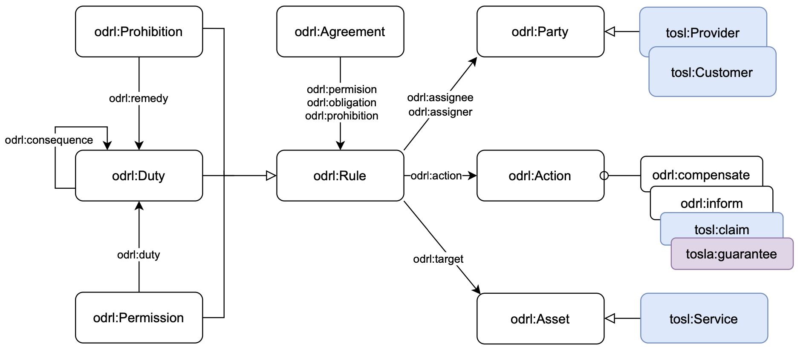
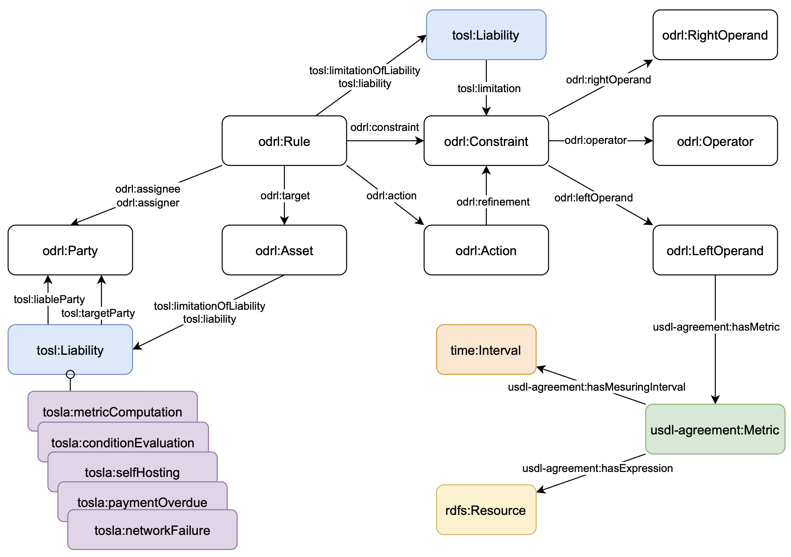

# TOSLA

Terms of Service Level Agreement (TOSLA) ODRL Profile is a vocabulary designed to incorporate the terminology necessary to semantically represent the terms defined in Service Level Agreements. It extends the W3C-recommended Open Digital Rights Language (ODRL) policy expression language standard.

With this model, based on a set of existing ontologies and domain-specific vocabularies, it is possible to formally and semantically interoperably represent the commitments undertaken by the provider to achieve defined levels of one or more Service Level Indicators (SLIs). In addition, the model enables the detailed description of:  

- The customer's obligations to monitor the fulfillment of such indicators and, where appropriate, to notify or submit claims in case of non-compliance.
- The provider's obligations to remedy and, optionally, to compensate when the established levels are not achieved.
- The conditions, metrics, and evaluation periods that determine the activation of these obligations.
- The exclusions of the provider's liability in cases of service unavailability due to certain circumstances beyond its control, which can also be formally defined as conditional clauses.  

## Profile diagram


---


## Sample with TOSLA

Partial example of how the terms of an SLA would be modelled. In particular, it shows a guarantee clause, the consequences in case of non-compliance, the obligation to file a claim and an example of compensation.

```ttl
# Assets description
:instanceEcsService a tosl:Service ;
    dcterms:description "Alibaba Cloud Elastic Compute Service (ECS) instance offering covered by this SLA." ;
    dcterms:rightsHolder :alibaba .

:serviceCredit a odrl:Asset ;
    rdfs:label "Service Credit"@en ;
    dcterms:description "A monetary credit applied to the Customer’s account as compensation for non-compliance with the Service Level Agreement." .

# Properties 
:monthlyUptimePercentageInstanceUnavailable a odrl:LeftOperand ;
    rdfs:label "Monthly Uptime Percentage - Instance Unavailable"@en ;
    dcterms:description "Percentage availability per ECS instance in the month." ;
    usdl-agreement:hasMetric :monthlyUptimeMetric .

:monthlyUptimeMetric a usdl-agreement:Metric ;
    qudt:unit <http://qudt.org/vocab/unit#Percent> ;
    usdl-agreement:hasExpression "100 * ((?serviceCycleMinutes - ?downtimeMinutes) / ?serviceCycleMinutes)"^^xsd:string ;
    usdl-agreement:hasMeasuringInterval :monthlyInterval .

:monthlyInterval a time:Interval ;
    time:hasDurationDescription [
        a time:DurationDescription ;
        time:months "1"^^xsd:integer
    ] .

:serviceCreditPercentage a odrl:LeftOperand ;
    rdfs:label "Service Credit Percentage"@en ;
    dcterms:description "Percentage of the Monthly Service Fee to credit." .

# Uptime Commitment Instance
:uptimeCommitmentInstance a odrl:Duty ;
    dcterms:description "Alibaba must provide at least 99.975% uptime per instance." ;
    odrl:assignee :alibaba ;
    odrl:target :instanceEcsService ;
    odrl:action [
        a odrl:Action ;
        rdf:value tosla:guarantee;
        odrl:refinement [
            a odrl:Constraint;
            odrl:leftOperand :monthlyUptimePercentageInstanceUnavailable ;
            odrl:operator odrl:gteq ;
            odrl:rightOperand "99.975"^^xsd:decimal ;
            odrl:unit <http://qudt.org/vocab/unit#Percent>
        ] ;
        odrl:refinement [
            a odrl:Constraint;
            odrl:leftOperand odrl:timeInterval;
            odrl:operator odrl:eq ;
            odrl:rightOperand "P30D"^^xsd:duration
        ]; 
    ];
    tosl:liability [ 
        a tosl:Liability ;
        dcterms:description "The customer is responsible for monitoring, calculating the total downtime and compiling all information regarding service unavailability in order to claim compensation.";
        rdf:value tosla:conditionEvaluation, tosla:metricComputation ;
        tosl:liableParty :customer 
    ] ;
    odrl:consequence :customerClaimInstance ;
    odrl:consequence :compensationInstance10 .

:customerClaimInstance a odrl:Duty ;
    dcterms:description "Customer must submit the claim within the defined time window." ;
    odrl:assignee :customer ;
    odrl:target :instanceEcsService ;
    odrl:action [
        a odrl:Action ;
        rdf:value tosl:claim ;
        odrl:refinement [
            a odrl:Constraint;
            odrl:leftOperand odrl:timeInterval ;
            odrl:operator odrl:eq ;
            odrl:rightOperand :claimWindow
        ] ;
    ] ;
    odrl:constraint [
        odrl:leftOperand :monthlyUptimePercentageInstanceUnavailable ;
        odrl:operator odrl:lt ;
        odrl:rightOperand "99.975"^^xsd:decimal ;
        odrl:unit <http://qudt.org/vocab/unit#Percent>
    ] .    
    
:compensationInstance10 a odrl:Duty ;
    dcterms:description "10% credit if instance uptime <99.975% but ≥99%." ;
    odrl:compensatedParty :customer ;
    odrl:compensatingParty :alibaba ;
    odrl:assignee :alibaba ;
    odrl:target :instanceEcsService ;
    odrl:action [
        a odrl:Action ;
        rdf:value odrl:compensate;
        odrl:refinement [
            a odrl:Constraint ;
            odrl:leftOperand :serviceCreditPercentage ;
            odrl:operator odrl:eq ;
            odrl:rightOperand "10"^^xsd:decimal ;
            odrl:unit <http://qudt.org/vocab/unit#Percent>
        ] ;
    ];
    odrl:constraint [
        a odrl:LogicalConstraint ;
        odrl:and (
            [ 
                a odrl:Constraint ;
                odrl:leftOperand :monthlyUptimePercentageInstanceUnavailable ; 
                odrl:operator odrl:gteq ; 
                odrl:rightOperand "99.0"^^xsd:decimal ;
                odrl:unit <http://qudt.org/vocab/unit#Percent>
            ]
            [ 
                a odrl:Constraint ;
                odrl:leftOperand :monthlyUptimePercentageInstanceUnavailable ; 
                odrl:operator odrl:lt ; 
                odrl:rightOperand "99.975"^^xsd:decimal ;
                odrl:unit <http://qudt.org/vocab/unit#Percent>
            ]
        )
    ] .
```

## Repository Structure

`bin/`
Scripts for running SPARQL queries. The "TOSLA_Analysis_of_Customer_Agreements.ipynb" notebook executes all queries on the modelled SLAs.

`docs/` Contains the TOSLA Ontology Requirements Specification Document.

`examples/`
TOSLA representations of real agreements include Amazon, Cedalo, and Alibaba.

`img/` Contains the conceptual metamodel.

`sparql_queries/`
SPARQL queries for analysing SLA information, deontic modalities and identifying potentially abusive terms.

`validator/` SHACL rules for testing SLA representation conformance to the TOSLA structure.

`tosla.ttl`
Ontology file (TBox), defining structured concepts.

## Running a Query Using Jupiter Notebook

1. Clone the repository.
2. Open the file `bin/competency_questions_evaluation.ipynb`.
3. Execute `Run All` and select your Python enviroment (version 3.10)
4. The first part of the notebook runs the TOSLA validator, followed by the sections for Competency Questions, Potentially Unfair Terms, and the Obligations, Permissions, and Prohibitions of the parties.
5. Execute the code cell and modify the KG as needed.

### Competency Questions Example
**CQ1:** *Which services are governed by the SLA?*  Below is an example of a SPARQL query to parse and execute this competency question.

```sparql
PREFIX odrl: <http://www.w3.org/ns/odrl/2/>
PREFIX tosl: <https://w3id.org/tosl/>
PREFIX dcterms: <http://purl.org/dc/terms/>
PREFIX foaf: <http://xmlns.com/foaf/0.1/>

SELECT DISTINCT ?agreement ?service ?serviceDescription
WHERE {
  ?agreement a odrl:Agreement ;
             odrl:assigner ?provider .
  
  ?provider odrl:assignerOf ?service .
  
  ?service a tosl:Service ;
           dcterms:description ?serviceDescription .
}
```

**Example result** – Execution over the *Amazon EC2 SLA*:

| Agreement                          | Service                              | Service Description                                                      |
|------------------------------------|--------------------------------------|--------------------------------------------------------------------------|
| http://example.com/amazonEC2SLA  | http://example.com/ec2RegionService | EC2 instances deployed across multiple AZs within a single region        |
| http://example.com/amazonEC2SLA  | http://example.com/ec2InstanceService  | Single Amazon EC2 instance                                               |

---
### Obligations and Rights Example

**Query:** *Select all duties assigned to the customer.*

```sparql
PREFIX odrl: <http://www.w3.org/ns/odrl/2/>
PREFIX dcterms: <http://purl.org/dc/terms/>
PREFIX tosl: <https://w3id.org/tosl/>
PREFIX rdf: <http://www.w3.org/1999/02/22-rdf-syntax-ns#>

SELECT ?duty 
       (GROUP_CONCAT(DISTINCT ?actionValue; separator=", ") AS ?actions)
       (GROUP_CONCAT(DISTINCT ?target; separator=", ") AS ?targets) 
       ?assignee
WHERE {
    ?duty a odrl:Duty ;
          odrl:assignee ?assignee ;
          odrl:target ?target ;
          odrl:action ?actionNode .
          
    ?assignee a tosl:Customer .

    OPTIONAL { ?actionNode rdf:value ?actionVal . }
    BIND(COALESCE(?actionVal, ?actionNode) AS ?actionValue)
} 
GROUP BY ?duty ?assignee
```

**Example result** – Execution over the *Amazon EC2 SLA*:

| Duty                                            | Actions                       | Targets                               | Assignee                           |
|-------------------------------------------------|--------------------------------|----------------------------------------|-------------------------------------|
| http://example.com/customerClaimEC2Region     | https://w3id.org/tosl/claim  | http://example.com/ec2RegionService  | http://example.com/customer       |
| http://example.com/customerClaimEC2Instance  | https://w3id.org/tosl/claim  | http://example.com/ec2RegionService  | http://example.com/customer       |

---

### Unfair Terms detection Example

**Goal:** Detect SLA terms where the **provider** reserves the right to modify the agreement **unilaterally**, without providing justification or prior notice.  

```sparql
PREFIX odrl: <http://www.w3.org/ns/odrl/2/>
PREFIX dcterms: <http://purl.org/dc/terms/>
PREFIX tosl: <https://w3id.org/tosl/>

SELECT ?permission ?description ?action ?target
WHERE {
    ?permission a odrl:Permission ;
        dcterms:description ?description ;
        odrl:action ?action ;
        odrl:assignee ?assignee ;
        odrl:target ?target .

    ?assignee a tosl:Provider .
    
    FILTER (?action = odrl:modify)
    OPTIONAL {
        ?permission odrl:constraint ?constraint .
        ?constraint odrl:leftOperand tosl:justification
    }
    OPTIONAL {
        ?permission odrl:duty ?duty .
        ?duty odrl:action odrl:inform .
    }
    FILTER (!BOUND(?constraint) || !BOUND(?duty))
}
```

**Example result** – Execution over the *Alibaba SLA*:


| permission                                     | description                                                                                                                                                                                   | action                              | target                                |
| ---------------------------------------------- | --------------------------------------------------------------------------------------------------------------------------------------------------------------------------------------------- | ------------------------------------ | -------------------------------------- |
| http://example.com/slaModificationPermission   | Alibaba reserves the right to unilaterally modify the terms of this SLA by posting an amended version on the Alibaba Cloud website. Continued use of the Service shall be deemed acceptance. | http://www.w3.org/ns/odrl/2/modify   | http://example.com/alibabaECSSLA       |


