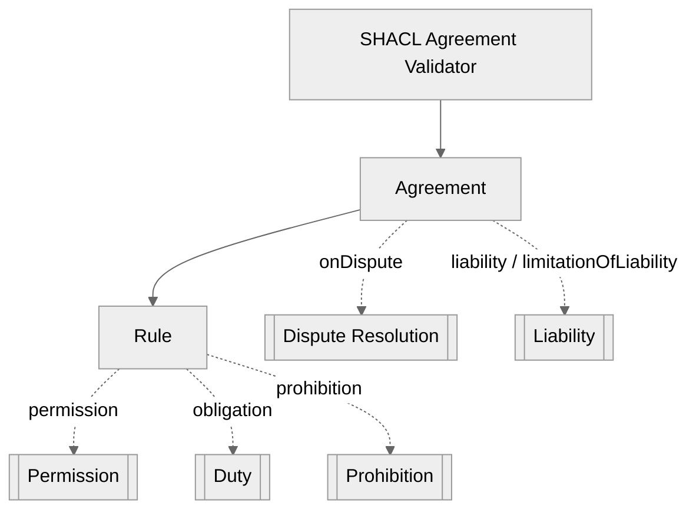
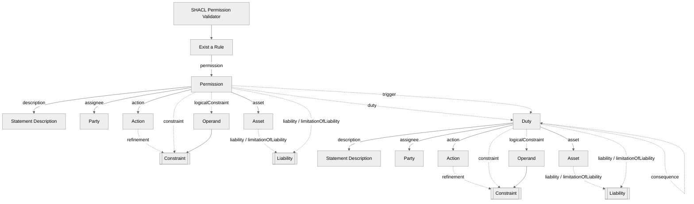
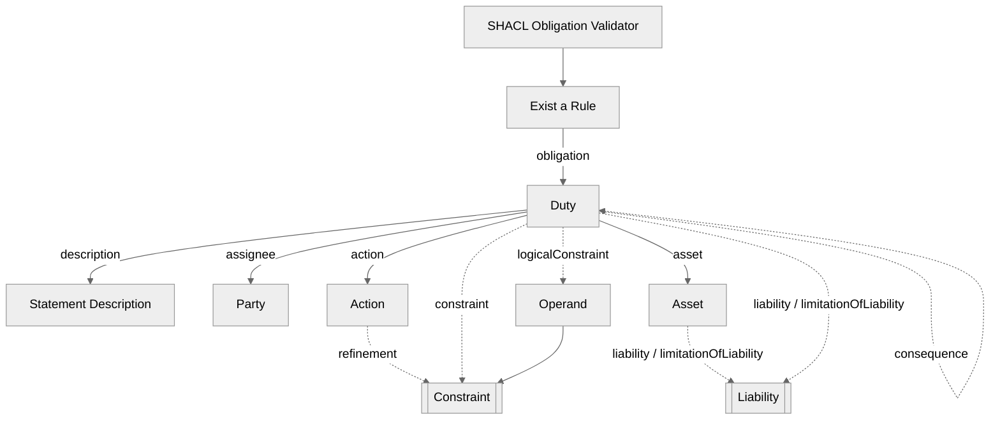
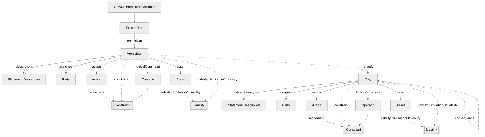
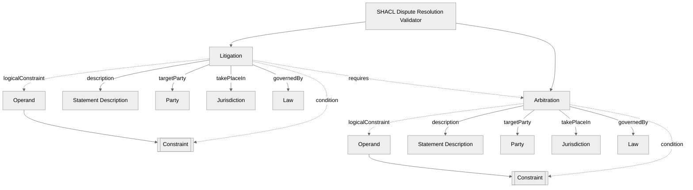
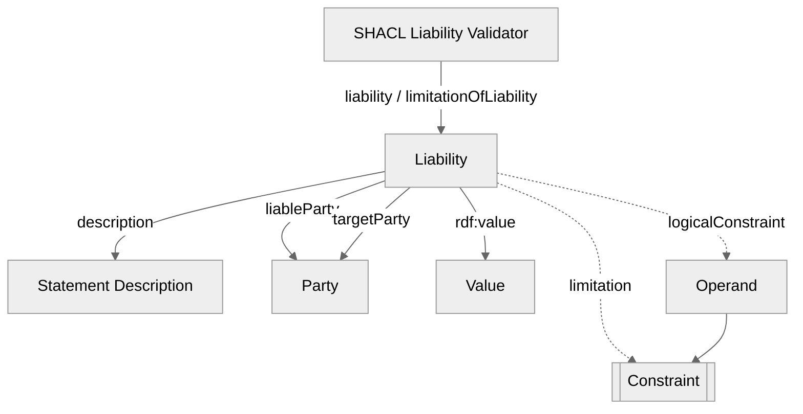
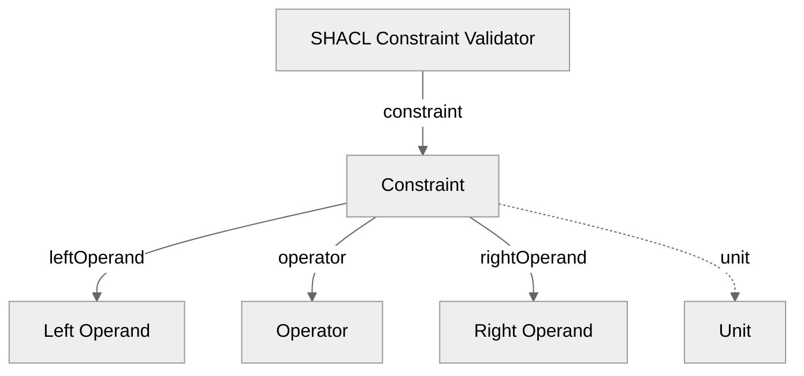

## TOSLA Validator

These diagrams represent the **validator shapes** for **TOSLA**. They visually define how **permissions**, **obligations**, **prohibitions**, **dispute resolution**, and **liability** statements are validated using **SHACL**, including validation of the predefined instances.

- **Solid arrows** represent **mandatory** elements in the model.
- **Dotted arrows** represent **optional** elements in the model.
- **Subroutine-shaped nodes** indicate that an **auxiliary validation subroutine** exists for that object (e.g., **Liability** and **Constraint**).

#### Permission Rule Validator Diagram

#### Duty Rule Validator Diagram

#### Prohibition Rule Validator Diagram

#### Dispute Resolution Validator Diagram

#### Liability  Validator Diagram

#### Constraint Validator Diagram

